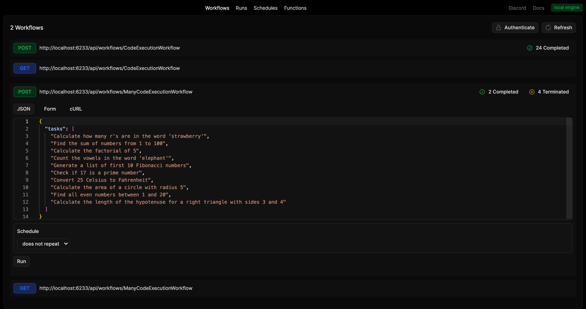

# E2B Code Execution with Restack AI

This repository demonstrates how to use [E2B](https://e2b.dev) for code execution at scale with [Restack](https://docs.restack.io/). E2B provides secure sandboxed environments for code execution, while Restack handles workflow orchestration and scaling.

## Prerequisites

- Docker (for running Restack)
- Python 3.10 or higher
- E2B API key ([Get it here](https://e2b.dev/docs/getting-started/api-key))
- OpenAI API key (for AI functionalities)

## Configuration

1. Copy `.env.Example` to `.env`
2. Add your API keys:
   ```
   E2B_API_KEY=<your-e2b-api-key>
   OPENAI_API_KEY=<your-openai-api-key>
   ```

## Start Restack

To start Restack locally, use the following Docker command:

```bash
docker run -d --pull always --name restack -p 5233:5233 -p 6233:6233 -p 7233:7233 ghcr.io/restackio/restack:main
```

## Setup Python Environment

```bash
poetry env use 3.10 && poetry shell
```

## Install Dependencies

```bash
poetry install
```

For IDE setup (optional):
```bash
poetry env info # Copy the interpreter path to use in your IDE (e.g. Cursor, VSCode)
```

Start the development server:
```bash
poetry run dev
```

## Running Workflows

### Via UI

Access the Restack UI to run and monitor workflows:



### Via API

Execute workflows through the Restack API endpoint:

`POST http://localhost:6233/api/workflows/GreetingWorkflow`

### Via Client

Run workflows programmatically using the Python client:

```bash
poetry run schedule
```

This executes `schedule_workflow.py` which connects to Restack and runs the `GreetingWorkflow`.

## Cloud Deployment

### Restack Cloud
Deploy your workflows on Restack Cloud:
1. Create an account at [Restack Console](https://console.restack.io)
2. Create a stack and import the cloned repository
3. Reference the Dockerfile path `community/e2b/Dockerfile` and the build context `community/e2b`
4. Set the environment variables for E2B and OpenAI. Restack environment variables are set automatically.


## Learn More
- [Restack Documentation](https://docs.restack.io)
- [E2B Documentation](https://e2b.dev/docs)

