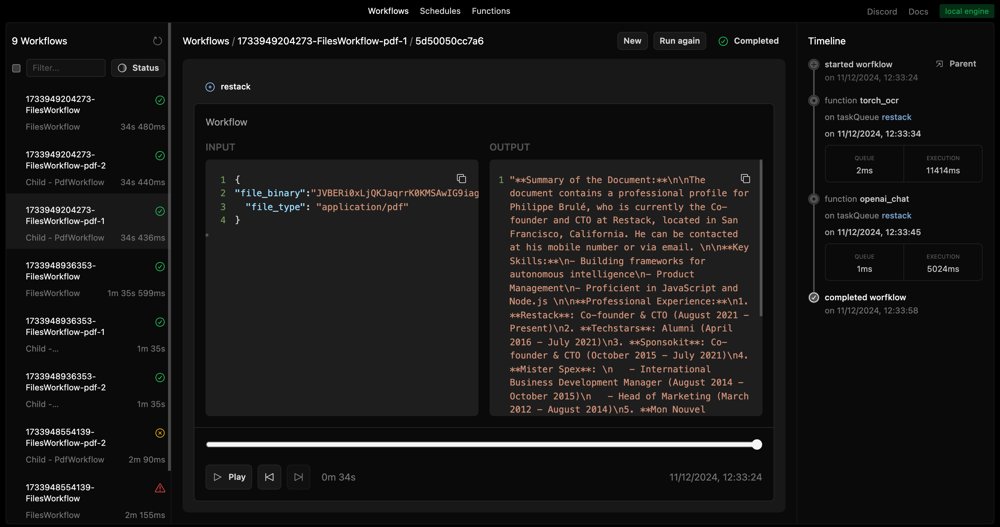

# Restack AI - PDF Pydantic

## Motivation

Demonstrates how scale multi step workflows with pydantic models.
Use pytorch to OCR and OpenAI to make a summary.
Runs a FastAPI and Swagger for testing.




## Prerequisites

- Python 3.11
- Poetry (for dependency management)
- Docker (for running the Restack services)

## Usage

1. Run Restack local engine with Docker:

   ```bash
   docker run -d --pull always --name restack -p 5233:5233 -p 6233:6233 -p 7233:7233 ghcr.io/restackio/restack:main
   ```

2. Open the web UI to see the workflows:

   ```bash
   http://localhost:5233
   ```

3. Clone this repository:

   ```bash
   git clone https://github.com/restackio/examples-python
   cd examples-python/examples/pdf_pydantic
   ```

4. Install dependencies using Poetry:

   ```bash
   poetry env use 3.11
   ```

   ```bash
   poetry shell
   ```

   ```bash
   poetry install
   ```

   ```bash
   poetry env info # Optional: copy the interpreter path to use in your IDE (e.g. Cursor, VSCode, etc.)
   ```

5. Run the services:

   ```bash
   poetry run main
   ```

   This will start Fast API with hot reload and Restack service with the defined workflows and functions.

6. Open FastAPI swagger UI :

http://127.0.0.1:8000/docs

7. Schedule workflow

Choose POST on /api/pdfs or /api/pdfs-parent and upload your pdfs

This will schedule the `PdfWorkflow` and print the result of summary after summary and openai call.

## Project Structure

- `src/`: Main source code directory
  - `client.py`: Initializes the Restack client
  - `functions/`: Contains function definitions
  - `workflows/`: Contains workflow definitions
  - `main.py`: Main FastAPI app
  - `services.py`: Sets up and runs the Restack services
