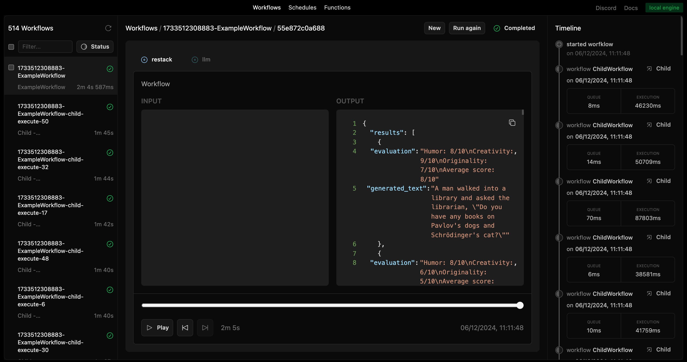
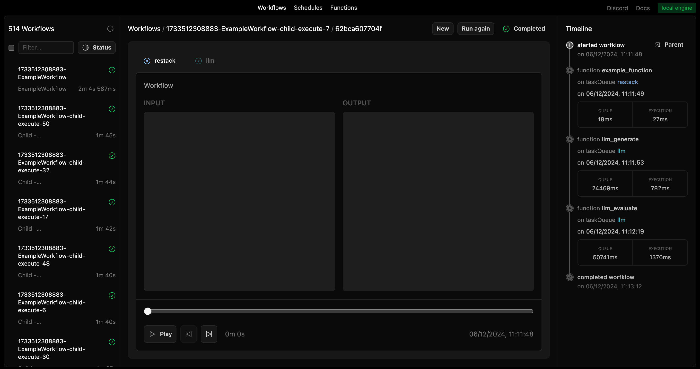

# Restack AI - Production Example

This repository contains a simple example project to help you scale with the Restack AI.
It demonstrates how to scale reliably to millions of workflows on a local machine with a local LLM provider.

## Walkthrough video

https://www.youtube.com/watch?v=Bdugs5kaYls

## Motivation

When scaling AI workflows, you want to make sure that you can handle failures and retries gracefully.
This example demonstrates how to do this with Restack AI.

### Workflow Steps

The table below shows the execution of 50 workflows in parallel, each with three steps.
Steps 2 and 3 are LLM functions that must adhere to a rate limit of 1 concurrent call per second.

| Step | Workflow 1 | Workflow 2 | ... | Workflow 50 |
| ---- | ---------- | ---------- | --- | ----------- |
| 1    | Basic      | Basic      | ... | Basic       |
| 2    | LLM        | LLM        | ... | LLM         |
| 3    | LLM        | LLM        | ... | LLM         |

### Traditional Rate Limit Management

When running multiple workflows in parallel, managing the rate limit for LLM functions is crucial. Here are common strategies:

1. **Task Queue**: Use a task queue (e.g., Celery, RabbitMQ) to schedule LLM calls, ensuring only one is processed at a time.
2. **Rate Limiting Middleware**: Implement middleware to queue requests and process them at the allowed rate.
3. **Semaphore or Locking**: Use a semaphore or lock to control access, ensuring only one LLM function runs per second.

### With Restack

Restack automates rate limit management, eliminating the need for manual strategies. Define the rate limit in the service options, and Restack handles queuing and execution:

```python
client.start_service(
    task_queue="llm",
    functions=[llm_generate, llm_evaluate],
    options=ServiceOptions(
        rate_limit=1,
        max_concurrent_function_runs=1
    )
)
```

Focus on building your logics while Restack ensures efficient and resilient workflow execution.

### On Restack UI

You can see from the parent workflow how long each child workflow stayed in queue and how long was the execution time.



And for each child workflow, for each step you can see how long the function stayed in queue, how long the function took to execute and how many retries happened.



## Prerequisites

- Python 3.8 or higher
- Poetry (for dependency management)
- Docker (for running the Restack services)
- Local LLM provider (we use LMStudio and a Meta Llama 3.1 8B Instruct 4bit model in this example)

## Usage

0. Start LM Studio and start local server with Meta Llama 3.1 8B Instruct 4bit model

https://lmstudio.ai

1. Run Restack local engine with Docker:

   ```bash
   docker run -d --pull always --name restack -p 5233:5233 -p 6233:6233 -p 7233:7233 ghcr.io/restackio/restack:main
   ```

2. Open the web UI to see the workflows:

   ```bash
   http://localhost:5233
   ```

3. Clone this repository:

   ```bash
   git clone https://github.com/restackio/examples-python
   cd examples-python/examples/production_demo
   ```

4. Install dependencies using Poetry:

   ```bash
   poetry env use 3.12
   ```

   ```bash
   poetry shell
   ```

   ```bash
   poetry install
   ```

   ```bash
   poetry env info # Optional: copy the interpreter path to use in your IDE (e.g. Cursor, VSCode, etc.)
   ```

5. Run the services:

   ```bash
   poetry run dev
   ```

   This will start the Restack service with the defined workflows and functions.

6. In a new terminal, schedule the workflow:

   ```bash
   poetry shell
   ```

   ```bash
   poetry run workflow
   ```

   This will schedule the ExampleWorkflow` and print the result.

7. Optionally, schedule the workflow to run on a interval:

   ```bash
   poetry run interval
   ```

8. Optionally, schedule a parent workflow to run 50 child workflows all at once:

   ```bash
   poetry run scale
   ```

## Project Structure

- `src/`: Main source code directory
  - `client.py`: Initializes the Restack client
  - `functions/`: Contains function definitions
  - `workflows/`: Contains workflow definitions
  - `services.py`: Sets up and runs the Restack services
- `schedule_workflow.py`: Example script to schedule and run a workflow
- `schedule_interval.py`: Example script to schedule and a workflow every second
- `schedule_scale.py`: Example script to schedule and run 100 workflows at once

# Deployment

Create an account on [Restack Cloud](https://console.restack.io)

Create an engine and get the engine id, address and api key.

In .envs add the following:
RESTACK_ENGINE_ID=<your-engine-id>
RESTACK_ENGINE_API_KEY=<your-engine-api-key>
RESTACK_ENGINE_ADDRESS=<your-engine-address>

In Restack Cloud workspace settings, generate a cloud token.

In .envs add the following:
RESTACK_CLOUD_TOKEN=<your-cloud-token>

Then execute restack up:

```bash
python restack_up.py
```

After you link your github to Restack Cloud, you will have a CI/CD pipeline to automatically deploy your changes.
